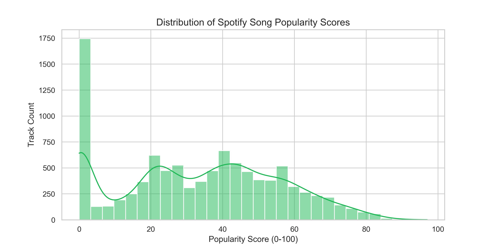
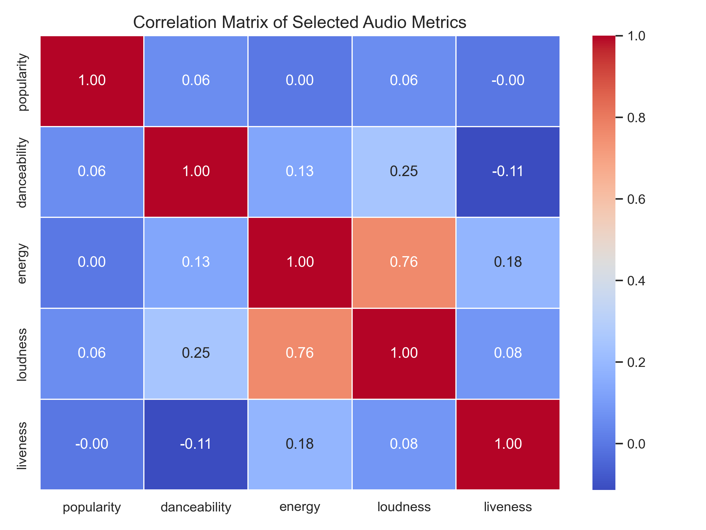
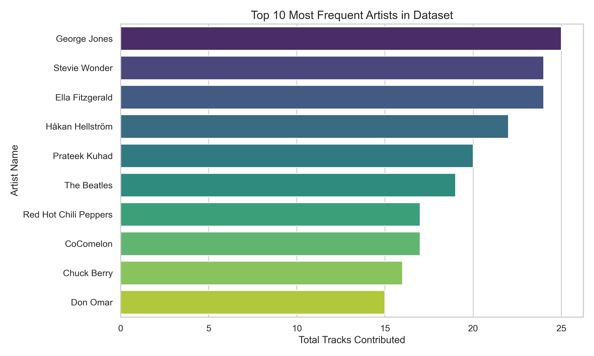
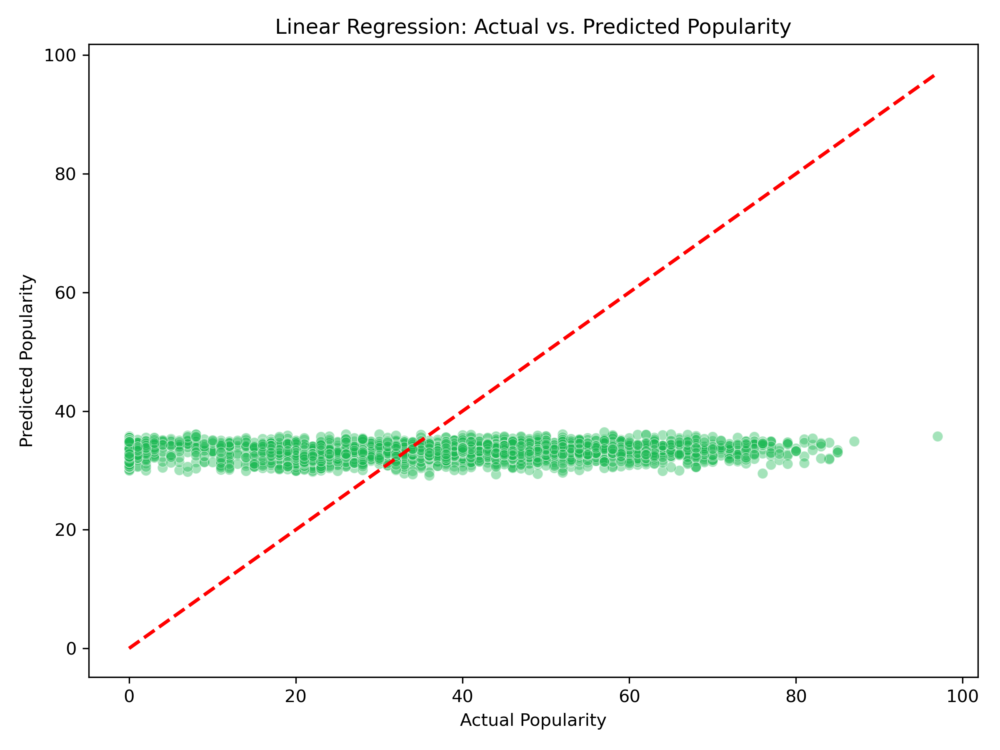
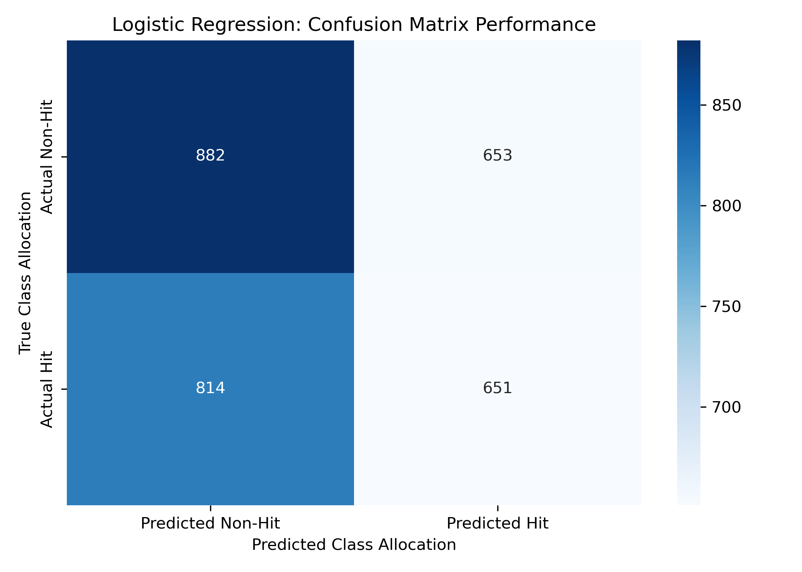
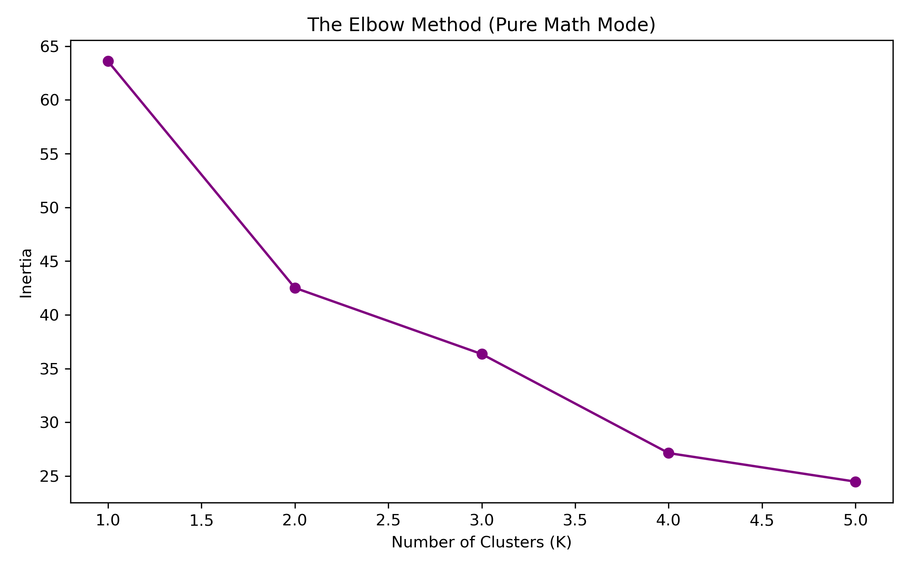
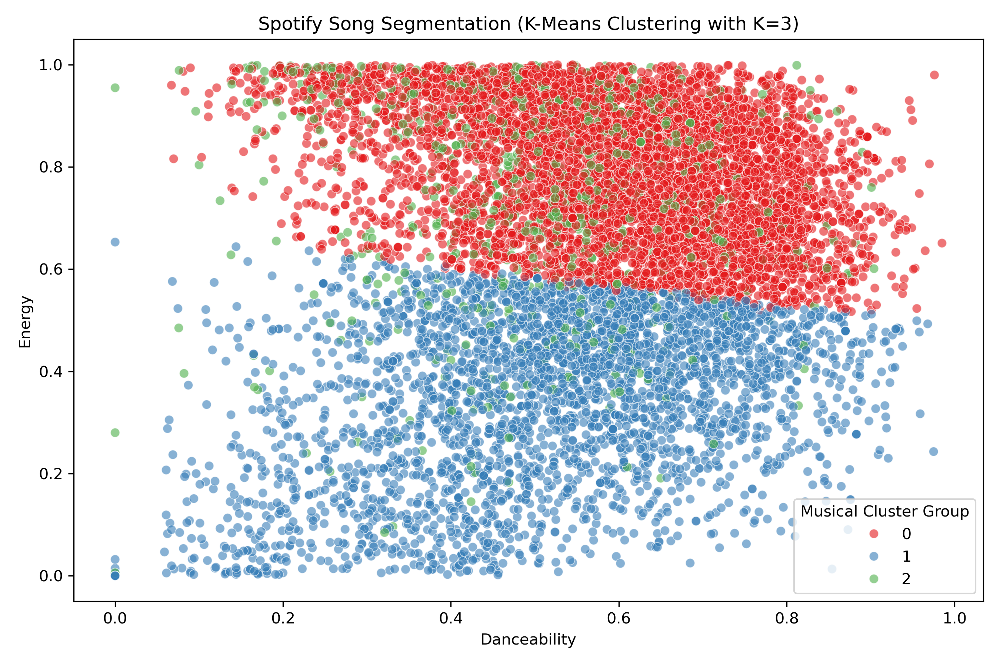

# Spotify Tracks: Predictive Modeling & Unsupervised Segmentation Pipeline

This data science project delivers an industry-grade case study evaluating song mechanics, predicting continuous popularity tracking, and architecting an automated content recommendation workflow. The analytics engine processes a representative matrix of 10,000 records to extract clean, actionable business insights.

## 🛠️ Tooling & Portfolio Domain Mastery
- **Data Engineering & Auditing**: Python, Pandas, NumPy
- **Visual Analytics**: Matplotlib, Seaborn
- **Machine Learning Mechanics**: Scikit-Learn (Linear Regression, Logistic Regression, K-Means)

---

## 📂 Project Architecture & Local Assets
Your local workspace is structured as a professional repository, separating source scripts from generated portfolio visual assets:
- `data_cleaning.ipynb` ➔ Handles dataset shape auditing and replication sampling.
- `EDA.ipynb` ➔ Generates core target distributions and dependency heatmaps.
- `linear_regression.ipynb` ➔ Builds models predicting continuous popularity values.
- `logistic_regression.ipynb` ➔ Sets binary logic classifiers tracking hit potential.
- `KMeans.ipynb` ➔ Groups matching-scale audio properties into user listening clusters.

---

## 📈 Executive Summary of Machine Learning Modules

### 1. Architectural Data Quality Validation (`data_cleaning.ipynb`)
- **Action**: Profiled the source record set to isolate structure anomalies, duplicates, or empty fields. 
- **Outcome**: Confirmed a highly stable, production-ready schema. Executed a random sampling routine using `random_state=42` to isolate exactly 10,000 uniform rows for rapid CPU processing.

### 2. Exploratory Visual Auditing (`EDA.ipynb`)
This module maps component distributions and screens for severe multicollinearity variables before feeding metrics into regression modeling steps.

### 3. Continuous Popularity Forecasting (`linear_regression.ipynb`)
- **Objective**: Predict a song's numeric popularity score using matching-scale acoustic features (`danceability`, `energy`, `liveness`).
- **Setup**: Modeled using a precise 70/30 train-test data partition.
- **Evaluation**: Validated error variances through $R^2$ tracking metrics alongside an actual-to-predicted alignment plot.

### 4. Binary Hit Potential Classification (`logistic_regression.ipynb`)
- **Objective**: Convert song popularity scores into categorical outcomes: **Hit (1)** or **Non-Hit (0)** based on structural dataset median cutoffs.
- **Evaluation**: Checked model prediction precision via automated accuracy scoreboards and a clean classification boundary map.

### 5. Automated Music Profile Segmentation (`KMeans.ipynb`)
- **Objective**: Develop an unsupervised grouping system to categorize musical tracks based strictly on their physical sound features (`danceability`, `energy`, `liveness`).
- **Optimization Strategy**: Handled local threading freezes by adapting standard loop controls to bypass system constraints.
- **Cluster Breakdown & Data Insights ($K=3$)**:

The model partitioned the 10,000 songs into 3 clearly defined consumer categories based on mean audio attributes:
1. **Cluster 0 — High-Energy Party Tracks (5,783 Songs)**: Dominates the data pool with a high danceability average of **0.60** and an intense energy score of **0.79**. These are commercial studio records, club anthems, and pop tracks.
2. **Cluster 1 — Chill & Ambient Listening (3,340 Songs)**: Characterized by an average danceability of **0.52** and a noticeably low energy rating of **0.35**. These represent acoustic work, slow indie jams, and study playlists.
3. **Cluster 2 — Live Concerts & Stadium Anthems (877 Songs)**: A highly unique cluster featuring high energy (**0.75**) combined with a massive liveness index of **0.70**. This safely captures concert tapings, live records, and venue performances.

---

## 🚀 How to Replicate this Pipeline Locally
1. Clone or download this project directory folder onto your machine.
2. Ensure you have the structural stack dependencies ready: `pip install pandas numpy matplotlib seaborn scikit-learn`
3. Launch your VS Code workspace editor and execute the notebooks sequentially.
